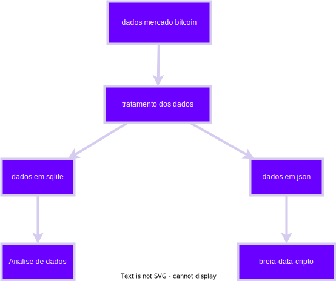

# Pipeline de Dados extraidos do site [Mercado Bitcoin](https://www.mercadobitcoin.com.br/)

## Descrição do Projeto
Pipeline de dados desenvolvido para coletar automaticamente os preços das criptomoedas Bitcoin (BTC), Ethereum (ETH), Solana (SOL), XRP, Tether (USDT): R$ 5,77 e Chainlink (LINK) do site mercadobitcoin.com.br através de webscraping com selenium. Os dados são processados, armazenados em formato JSON e em um banco de dados SQLite, preparando-os para futura integração com a plataforma "breia-data-cripto".

## Funcionalidades
- Webscraping automatizado do Mercado Bitcoin
- Coleta de preços de BTC, ETH e SOL
- Processamento e limpeza dos dados
- Armazenamento dual (JSON e SQLite)
- Orquestração automatizada via Airflow

## Tecnologias Utilizadas
- Python
- Apache Airflow
- SQLite
- Json
- Docker
- Selenium (webscraping)
- Pandas (processamento de dados)

## Conteudo do repositorio

- `...`

## Fluxo de Dados
1. **Extração**: Coleta automática dos preços via webscraping
2. **Transformação**: Processamento e formatação dos dados
3. **Carregamento**: 
   - Exportação para arquivos JSON
   - Armazenamento em banco SQLite
4. **Orquestração**: Gerenciamento do pipeline via Airflow

## Próximas Etapas
- Desenvolvimento da plataforma "breia-data-cripto"
- Implementação da integração automática dos dados coletados
- Interface de visualização dos dados

